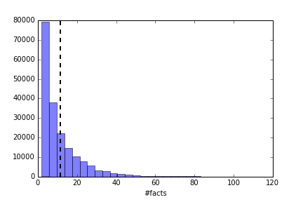

# Deep Medical Diagnosis

QA solving using DL methods applied to medical diagnosis. The main models used are a RNN and a memnet.

## Dataset

We have a dataset of about 1500 diseases with their symptoms. The data format is similar to the dataset from 
babi task (Facebook). For example, for the disease Achasia:

### Exploratory analysis of the dataset

We have about 1500 diseases in our dataset. Summarizing:

 * Vocabulary size: 21520 words
 * Story max length: 1647 words
 * Training stories: 133093
 * Test stories: 59394
 
The next plot show the proportion of fact list per data element:

